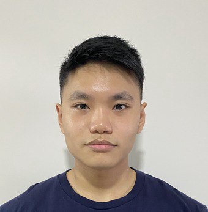

# About Us

We are a team based in the [School of Computing, National University of Singapore](http://www.comp.nus.edu.sg).

You can reach us at the email `seer[at]comp.nus.edu.sg`

## Project team

### Shaine Annalisse Gan

[[homepage](https://shainegan1407.github.io/portfolio/)]
[[github](https://github.com/shainegan1407)]

* Role: Documentation

### Reyes Tan

[[github](http://github.com/reyestyh)]

* Role: Team Lead
* Responsibilities: Integration

### Jiaxiang Zhang

[[github](http://github.com/Zhang-Jiaxiang0923)]

* Role: Developer
* Responsibilities: Code quality

### Tristan Lim Yi Rong

[[github](http://github.com/tristanlimyr)]

* Role: Developer
* Responsibilities: Testing
