# TripScribe User Guide

TripScribe is a desktop app built for **operations executives at tour agencies** who manage client contacts, vendor bookings and itineraries on a daily basis. If you can type fast, TripScribe lets you **manage contacts and itineraries** much faster than other mouse-based apps, through a simple command-based interface with an informative and clean view.

<box type="tip" seamless>

**New to TripScribe?**<br>
Start with [Quick Start](#quick-start) to install the app and try your first commands.

**Looking for a specific command?**<br>
Jump to the [Command Summary](#command-summary) for a quick reference, or pick a feature from the table of contents below.

**Need help with something?**<br>
Jump to our [FAQ](#faq) and [Troubleshooting](#troubleshooting) sections.

</box>

<!-- * Table of Contents -->
<page-nav-print />

--------------------------------------------------------------------------------------------------------------------
<div style="page-break-after: always;"></div>

## Table of Contents

1. [Quick Start](#quick-start)
    - [Setting Up Java for TripScribe](#setting-up-java-for-tripscribe)
    - [Downloading TripScribe](#downloading-tripscribe)
    - [Running TripScribe](#running-tripscribe)
    - [Understanding TripScribe's Interface](#understanding-tripscribe-s-interface)
    - [Introductory Tutorial](#introductory-tutorial)
2. [Features](#features)
    - [Reading Command Format](#reading-command-formats)
    - [Viewing Help : `help`](#viewing-help-help)
    - [Adding a Contact : `addc`](#adding-a-contact-addc)
    - [Adding an Itinerary : `addi`](#adding-an-itinerary-addi)
    - [Listing Contacts and Itineraries : `list`](#listing-contacts-and-itineraries-list)
    - [Editing Contacts and Itineraries : `edit`](#editing-contacts-and-itineraries-edit)
    - [Showing details of an itinerary: `show`](#showing-contacts-by-itinerary-show)
    - [Finding Contacts by Name : `find`](#finding-contacts-by-keywords-find)
    - [Deleting a Contact or Itinerary : `delete`](#deleting-a-contact-or-itinerary-delete)
    - [Clearing All Entries : `clear`](#clearing-all-entries-clear)
    - [Exiting TripScribe : `exit`](#exiting-tripscribe-exit)
    - [Command Summary](#command-summary)
3. [Data Management](#data-management)
    - [Saving Your Data](#saving-your-data)
    - [Backing Up Your Data](#backing-up-your-data)
    - [Editing Your Data File](#editing-your-data-file)
4. [FAQ](#faq)
5. [Troubleshooting](#troubleshooting)
    - [Adding Contacts](#adding-contacts)
    - [Adding Itineraries](#adding-itineraries)
    - [Editing Contacts](#editing-contacts)
    - [Editing Itineraries](#editing-itineraries)
    - [Finding Contacts](#finding-contacts)
6. [Glossary](#glossary)
7. [Known Issues](#known-issues)

--------------------------------------------------------------------------------------------------------------------
<div style="page-break-after: always;"></div>

## Quick Start

#### Setting Up Java for TripScribe
TripScribe needs Java `17` or above to run. Here is how to check if you already have it installed:
1. Open a command terminal as follows:

    | Your computer | Steps to open a terminal                          |
    |---------------|---------------------------------------------------|
    | Windows       | Press `Win + R`, type `cmd`, press Enter          |
    | Mac           | Press `Cmd + Space`, type `Terminal`, press Enter |
    | Linux         | Press `Ctrl + Alt + T`                            |

2. Type the following command and press Enter:
      ```
      java -version
      ```
3. If the output shows `version "17"` or higher, you are all set. If you get an error, download Java 17 by following one of these installation guides:
    * Installation guide for Linux users [here](https://se-education.org/guides/tutorials/javaInstallationLinux.html).
    * Installation guide for Windows users [here](https://se-education.org/guides/tutorials/javaInstallationWindows.html).
    * Installation guide for Mac users [here](https://se-education.org/guides/tutorials/javaInstallationMac.html).

#### Downloading TripScribe
1. Download the latest `TripScribe.jar` file from [here](https://github.com/AY2526S2-CS2103T-F12-1/tp/releases). Look for the release with the `Latest` tag. You can ignore the other files.
2. Move the file to a folder of your choice. For example, a folder called `TripScribe` on your desktop.

<div style="page-break-after: always;"></div>

#### Running TripScribe
1. Open a command terminal, as described in [Set Up Java for TripScribe](#setting-up-java-for-tripscribe).
2. Navigate into the folder containing the `TripScribe.jar` file using the `cd` command:
      ```
      cd path/to/your/folder
      ```
   * For example:
     * **Linux/Mac:** `cd ~/Desktop/TripScribe`
     * **Windows:** `cd C:\Users\YourName\Desktop\TripScribe`

3. Run TripScribe by typing the command `java -jar TripScribe.jar` into the terminal.<br>
A pop-up window similar to the below should appear in a few seconds. <br>

   
| 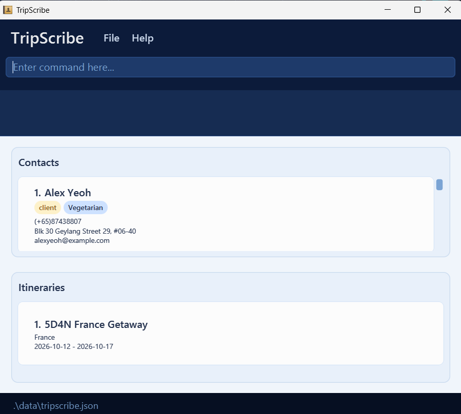<br>TripScribe Window |
|:-----------------------------------------------------------------------------------:|

<div style="page-break-after: always;"></div>

#### Understanding TripScribe's Interface
Before you get started, here is a quick guide on navigating TripScribe's interface. After opening TripScribe, you will see a window like this:

| 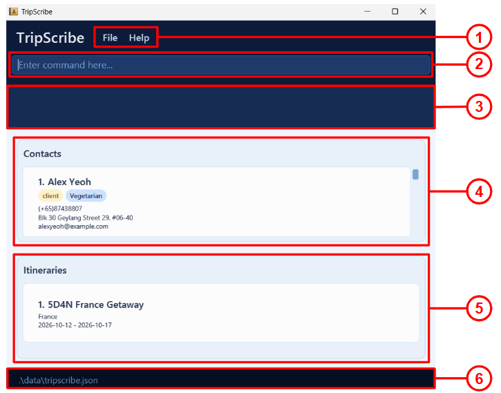 <br>TripScribe Interface |
|:-----------------------------------------------------------------------------------------------------------:|

Here are the key elements of this interface:
1. **Menu Bar**: Click on `File` to access the `Exit` button and click on `Help` to access our help window.
2. **Command Box**: Type your commands here and press Enter to execute them.
3. **Result Display**: See the outcomes of your commands here. For example, confirmation messages or error messages.
4. **Contact Panel**: See your list of contacts here. Each contact is displayed as a card.
5. **Itinerary Panel**: See your list of itineraries here. Each itinerary is displayed as a card.
6. **Status Bar**: See the location of your data file on your computer here.

<box type="tip" seamless>

**Note:** TripScribe loads sample contact and itinerary data on first use so that you can start exploring features right away. If you wish to remove all sample data, simply use the [clear command](#clearing-all-entries-clear).

</box>

<div style="page-break-after: always;"></div>

#### Introductory Tutorial
Explore TripScribe's basic features by trying out your first commands. For each command listed below, type the command in the command box, and press Enter to execute it.

| Action                                           | Command                                                                                               |
|--------------------------------------------------|-------------------------------------------------------------------------------------------------------|
| List all contacts                                | `list /contact`                                                                                       |
| Add a contact named `John Doe`                   | `addc r/client n/John Doe p/(+65) 98765432 e/johnd@example.com`<br>`a/John street, block 123, #01-01` |
| Add an itinerary named `Bali Getaway`            | `addi n/Bali Getaway dest/Bali from/2026-07-01 to/2026-07-05`                                         |
| Delete the 3rd contact shown in the current list | `delete /contact 3`                                                                                   |
| Clear all contacts and itineraries               | `clear`                                                                                               |
| Open the help window                             | `help`                                                                                                |
| Exit TripScribe                                  | `exit`                                                                                                |

To learn more details of each command, you can refer to [Features](#features) below.

--------------------------------------------------------------------------------------------------------------------
<div style="page-break-after: always;"></div>

## Features

All commands follow a consistent format throughout this guide. In brief, words in **UPPER_CASE** are values you supply, and items in **[square brackets]** are optional. For a full explanation, you can refer to [Reading Command Formats](#reading-command-formats) below.

<box type="warning" seamless>

If you are using a PDF version of this document, be careful when copying and pasting commands that span multiple lines, as there may be formatting issues which affect the copied text.

</box>

### Reading Command Formats

<box type="info" seamless>

- Words in `UPPER_CASE` are values you supply.
    - **Example:** In `addc r/ROLE`, `ROLE` is entered as `addc r/client`.
- Items in square brackets are optional.
    - **Example:** `n/NAME [t/TAG]` can be entered as `n/John Doe t/Bus` or `n/John Doe`.
- Inputs with `…`​ after them can be used zero or more times.
    - **Example:**`[t/TAG]…​` can be used as ` ` (used zero times), `t/Bus`, `t/Bus t/SpeaksEnglish` etc.
- Information can be supplied in any order.
  - **Example:** If the command specifies `n/NAME p/PHONE_NUMBER`, `p/PHONE_NUMBER n/NAME` is also acceptable.
- Additional parameters for commands that do not require them (such as `help`, `exit` and `clear`) will be ignored.
    - **Example:** `help 123` is interpreted as `help`.

</box>

<box type="tip" seamless>

**Tip:**
See an unfamiliar term? Jump to our [Glossary](#glossary) for its definition.

</box>

<div style="page-break-after: always;"></div>

### Viewing help : `help`

You can open a help window that summarizes all commands, their formats and helpful examples using this command. For more detailed instructions, you can copy the User Guide URL from the help window, and paste it into your browser to access this guide.

Use this when you need a quick reference of command formats, or want to access the full this guide.

**Format:**
```
help
```

| 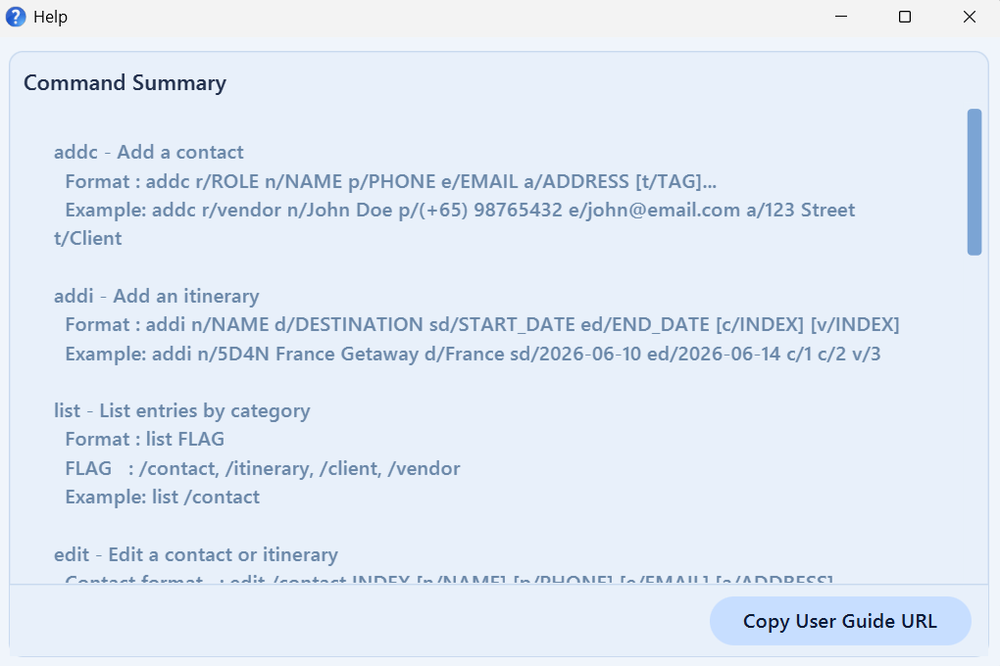<br>Help Window |
|:-------------------------------------------------------------------------------:|


<box type="tip" seamless>

**Tip:**
You can also open the help window by clicking **`Help`** in the menu bar.

</box>

<div style="page-break-after: always;"></div>

### Adding a Contact: `addc`

You can add a contact to TripScribe as a client or a vendor, and store their important details using this command.<br>

You must specify the contact's role, name, phone number, email, and address to add them into TripScribe, while tags are optional and can be modified later.

**Format:**
```
addc r/ROLE n/NAME p/PHONE_NUMBER e/EMAIL a/ADDRESS [t/TAG]…​
```

<box type="tip" seamless>

**Things to note:**
- `ROLE` must be either `client` or `vendor`.
- Phone numbers should follow the format `(+COUNTRY_CODE) PHONE_NUMBER`
  - Example: `(+65) 98765432`.
- A contact can have any number of tags (including zero).
- Tags only accept alphanumeric values (no symbols, punctuation, spaces, etc.).
  - Example: `PeanutAllergy` is allowed, but `Peanut Allergy` is not allowed as it contains a space.
- TripScribe treats two contacts as duplicates if they share the **same name and phone number**. Duplicate contacts cannot be added.

</box>

**Examples:**
* `addc r/client n/John Doe p/(+65) 98765432 e/johnd@gmail.com a/123 street, block 123, #01-01`
  * Adds a client named "John Doe" with the provided contact details.
* `addc r/vendor n/Holiday Inn t/FourStar e/holidayinn@gmail.com a/New York City p/(+44) 81234567 t/Hotel`
  * Adds a vendor named "Holiday Inn" with tags "Hotel" and "FourStar".

| 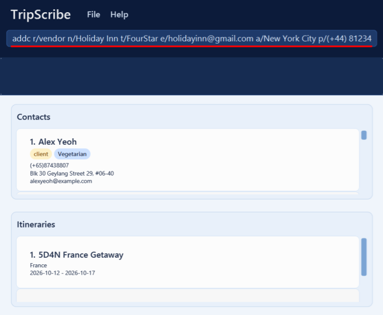<br>Input | 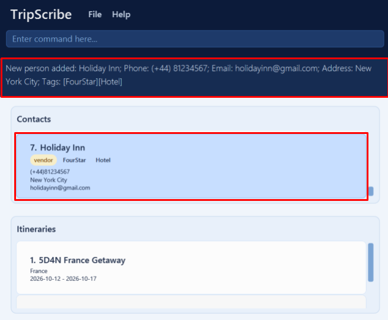<br>Expected Output |
|:-----------------------------------------------------------------------------------------------------------:|:---------------------------------------------------------------------------------------------------------------:|

<div style="page-break-after: always;"></div>


### Adding an Itinerary: `addi`

You can add an itinerary to TripScribe and store their important details using this command. Optionally, you can link relevant contacts involved to the itinerary. <br>

You must specify the itinerary name, destination, start and end date to add them into TripScribe.

**Format:** 
```
addi n/ITINERARY_NAME dest/DESTINATION from/START_DATE to/END_DATE [c/CLIENT_INDEX]…​ [v/VENDOR_INDEX]…​
```

<box type="tip" seamless>

**Things to note:**
- `ITINERARY_NAME` and `DESTINATION` cannot be blank.
- TripScribe treats two itineraries as duplicates if they **share the same name** (case-insensitive), **same destination**, and **same date range**. Duplicate itineraries cannot be added.
  - Example: Itineraries with the names `ISLAND TIME: Bali` and `Island Time: Bali` are considered to have the same name.
- `START_DATE` and `END_DATE` must be in the format `yyyy-mm-dd`.
  - Example: `20th March 2026` should be entered as `2026-03-20`.
- `END_DATE` must be **equal to or after** `START_DATE`.
  - Example: `from/2026-03-20 to/2026-03-19` is not allowed.
- `CLIENT_INDEX` and `VENDOR_INDEX` are the indexes of the contacts in the current TripScribe window.
- An itinerary can have any number of clients and vendors (including zero).
- If a contact is a client, you cannot add them as a vendor, and vice versa.
  - Example: `c/2` will fail if the contact at index 2 is a vendor.  `v/3` will fail if the contact at index 3 is a client
- If you want to add multiple clients or vendors into the itinerary, ensure that you indicate the correct prefix for each index.
  - Example: `c/2 c/3 c/4 v/1 v/5 v/6` will add the 2nd, 3rd and 4th contacts in the client list and the 1st, 5th and 6th contacts in the vendor list (if they are of the correct role).  
</box>

**Examples:**
* `addi n/Island Time: Bali dest/Bali from/2026-12-01 to/2026-12-05`
  * Add an itinerary named "Island Time: Bali" with no contacts linked.
* `addi n/3D2N China Trip dest/China from/2026-05-02 to/2026-05-07 c/2 c/3 c/5 v/1 v/4`
  * Add an itinerary named "5D4N France Getaway" with three clients (contacts 2, 3, and 5) and two vendors (contacts 1 and 4).
* `addi n/5D4N France Getaway dest/France from/2026-10-12 to/2026-10-17 c/2 v/3`
    * Add an itinerary named "5D4N France Getaway" with the 2nd contact (must be a client) and 3rd contact (must be a vendor) linked to it.

| 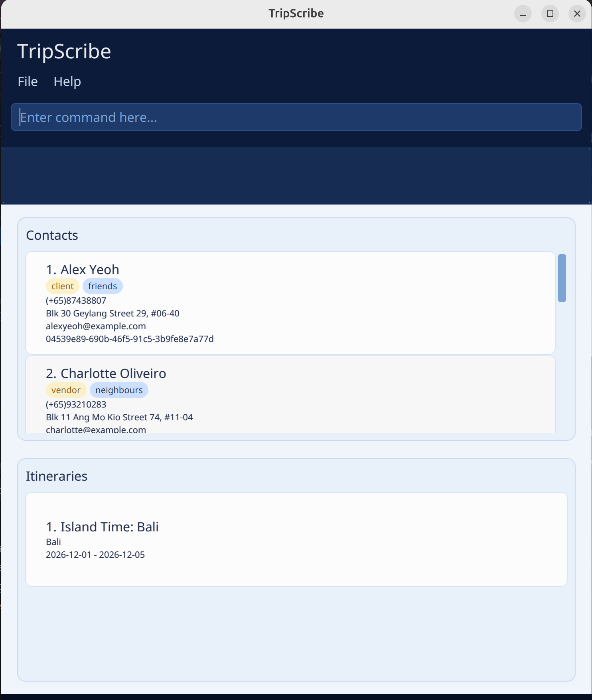<br>Input (3rd Example) | 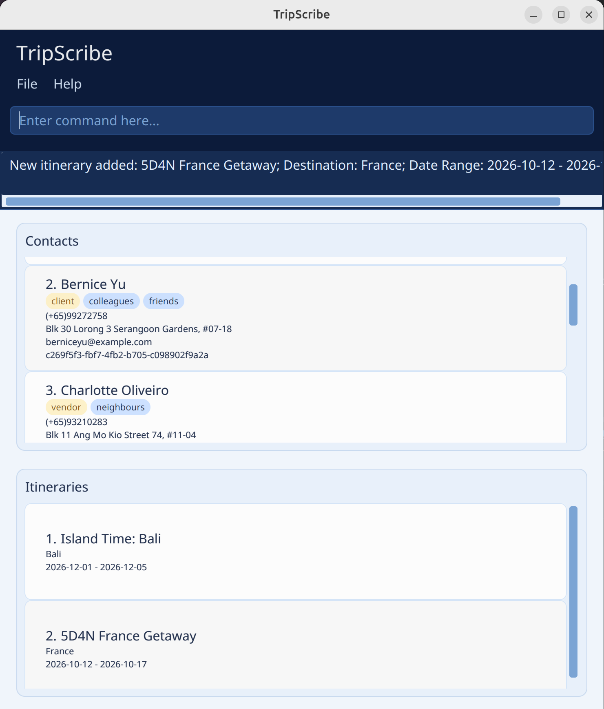<br>Expected Output |
|:---------------------------------------------------------------------------------------------------------------------:|:-------------------------------------------------------------------------------------------------------------------:|

<div style="page-break-after: always;"></div>


### Listing Contacts and Itineraries : `list`

You can display a filtered list of contacts or itineraries in your workspace using this command. The workspace will be updated based on the specified flag you supply.

Use this when you want to view your whole database, switch between viewing contacts and itineraries or filter contacts by their role.

**Format:**
```
list /FLAG
```
<box type="tip" seamless>

**Things to note:**
* `FLAG` specifies the entry type you are listing. It must be one of: `contact`, `client`, `vendor`, `itinerary`, `all`.

    | Flag        | What you see                           |
    |-------------|----------------------------------------|
    | `contact`   | All contacts, both clients and vendors |
    | `client`    | Only clients                           |
    | `vendor`    | Only vendors                           |
    | `itinerary` | All itineraries                        |
    | `all`       | All contacts and itineraries           |


* When you view contacts (`contact`, `client`, `vendor`), TripScribe hides the itinerary panel.
* When you view itineraries (`itinerary`), TripScribe hides the contact panel.
</box>

**Examples:**
* `list /all`
    * Shows both contacts and itineraries in their respective panels
* `list /contact`
  * Shows all contacts (both clients and vendors), hides the itinerary panel

<div style="page-break-after: always;"></div>

### Editing Contacts and Itineraries : `edit`

You can edit an existing contact or itinerary in TripScribe using this command. TripScribe currently supports editing of all contacts fields, but only supports editing of name, destination and dates for itineraries. 

Use this when contact or itinerary details change and require an update.

**Formats:**

Editing a Contact:
```
edit /contact INDEX [r/ROLE] [n/NAME] [p/PHONE] [e/EMAIL] [a/ADDRESS] [t/TAG]…​
```

Editing an Itinerary:
```
edit /itinerary INDEX [n/NAME] [dest/DESTINATION] [from/START_DATE] [to/END_DATE] ​
```

<box type="warning" seamless>

**Warning:**
When editing contacts, editing tags **replaces all existing tags** of the contact, it does not add on to them. 

If you want to keep the contact's current tags, make sure to add **all existing tags** in addition to the new tags you are adding.

</box>

<box type="tip" seamless>

**Things to note:**

* Edits the contact or itinerary at the specified `INDEX`.
* `INDEX` is the index number shown in the displayed contact or itinerary list. It **must be a positive, non-zero number** (e.g., 1, 2, 3, …​)
* You must include at least one field to change.
* You can remove all tags from a contact by typing `t/` without specifying any tags after it.
* When editing itineraries, you must ensure that the end date is after the start date. 

</box>

**Examples:**
* `edit /contact 1 p/(+65) 91234567 e/johndoe@example.com`
    * Edits the phone number and email address of the 1st person to be `(+65) 91234567` and `johndoe@example.com` respectively.
* `edit /contact 2 n/Betsy Crower t/`
    * Edits the name of the 2nd person to be `Betsy Crower` and clears all existing tags.
* `edit /itinerary 1 n/Bali 4D3N`
    * Edits the name of the 1st itinerary to be `Bali 4D3N`.

<div style="page-break-after: always;"></div>


### Showing contacts by itinerary: `show`

You can show the details of a specific itinerary and its associated contacts associated using this command. 

Use this when you want to see all the contacts involved in a specific itinerary.  

**Format:**
```
show INDEX
```

<box type="tip" seamless>

**Things to note:**

* Shows contacts and itinerary details of itinerary at specified `INDEX`.
  * The itinerary list will only show the specified itinerary details.
  * The contact panel will only show the contacts linked to that itinerary.
* `INDEX` is the index number shown in the itinerary list. It **must be a positive, non-zero number** (e.g., 1, 2, 3, …​)

</box>

**Examples:**
* `show 1`
  * Shows details of the 1st itinerary, and the contacts associated with it.

| 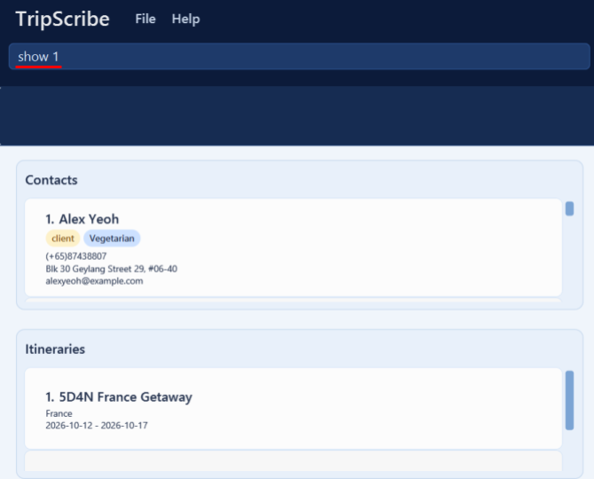<br>Input | 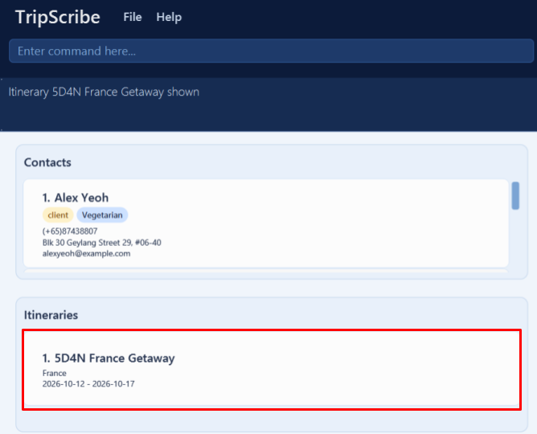<br>Expected Output |
|:----------------------------------------------------------------------------------------------:|:--------------------------------------------------------------------------------------------------:|


<div style="page-break-after: always;"></div>


### Finding Contacts by Keywords: `find`

You can find contacts whose fields match the given keywords using this command. TripScribe currently supports two forms of searching.

* Use general search to search **all** fields of a contact (excluding its role).
    * A contact is returned if the given keyword(s) appears in any of its fields
* Use multi-field search to search only **specific** field(s) of a contact.
    * If a contact contains the given keyword(s) in the specified field(s), it will be returned.

**Formats:**

General Search Format:
```
find KEYWORD [MORE_KEYWORDS]… ​
```

Multi-Field Search Format:
```
find [n/NAME_KEYWORDS] [p/PHONE_KEYWORDS] [e/EMAIL_KEYWORDS] [a/ADDRESS_KEYWORDS] [t/TAG_KEYWORDS]… ​
```

<box type="warning" seamless>

**Warning:**
Do not mix general search and multi-field search in the same command.  
Example: `find Hans p/9876` is invalid.

</box>

<box type="tip" seamless>

**Things to note:**
* The search is case-insensitive.
  * Example: `hans` will match `Hans`.
* The order of the keywords does not matter.
  * Example: `Hans Bo` will match `Bo Hans`.
* Partial matches are allowed.
  * Example: `Han` will match `Hans`.
* This command does not support searching for the role prefix `r/`, and does not search the role field.

</box>

**Examples:**

General Search:
* `find John`
  * Returns contacts whose name, phone, email, address, or tags contain `John`.
* `find alex david`
  * Returns contacts containing `alex` or `david` in any searchable field.

Multi-Field Search:
* `find e/example.com`
  * Returns contacts with `example.com` in their saved email.
* `find n/alex david`
  * Returns contacts whose names contain `alex` or `david`.
* `find n/alex p/996`
  * Returns contacts whose names contain `alex` and whose phone numbers contain `996`.<br>


<div style="page-break-after: always;"></div>

### Deleting a Contact or Itinerary : `delete`

You can delete a specified contact or itinerary from TripScribe using this command.

Use this to clean up your contact and itinerary entries and ensure your data is up-to-date. 

**Format:**
```
delete /FLAG INDEX
```
<box type="tip" seamless>

**Things to note:**
* This will delete the contact or itinerary at the specified `INDEX`.
* `FLAG` specifies the entry type you are deleting. It must be one of: `contact` , `itinerary`.
* `INDEX` is the index number shown in the displayed person or itinerary list. It **must be a positive, non-zero number** (e.g., 1, 2, 3, …​)
* When deleting a contact, the contact will be also be removed from any itineraries it is part of.

</box>

**Examples:**
* `list /contact` followed by `delete /contact 2` deletes the 2nd contact in TripScribe.


| 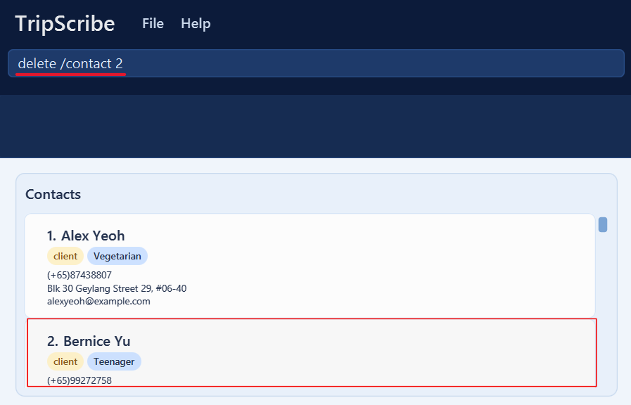<br>Input | * 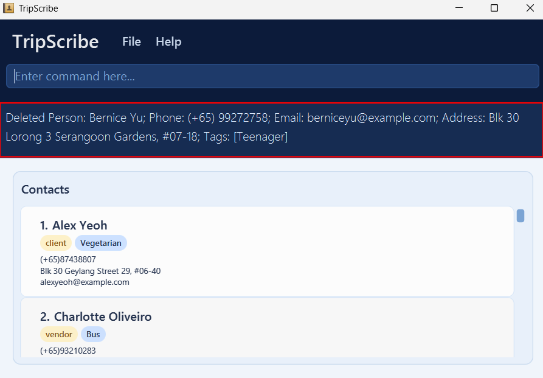<br>Expected Output |
|:-----------------------------------------------------------------------------------------------------------------:|:-----------------------------------------------------------------------------------------------------------------------:|

* `list /itinerary` followed by `delete /itinerary 1` deletes the 1st itinerary in TripScribe.

| 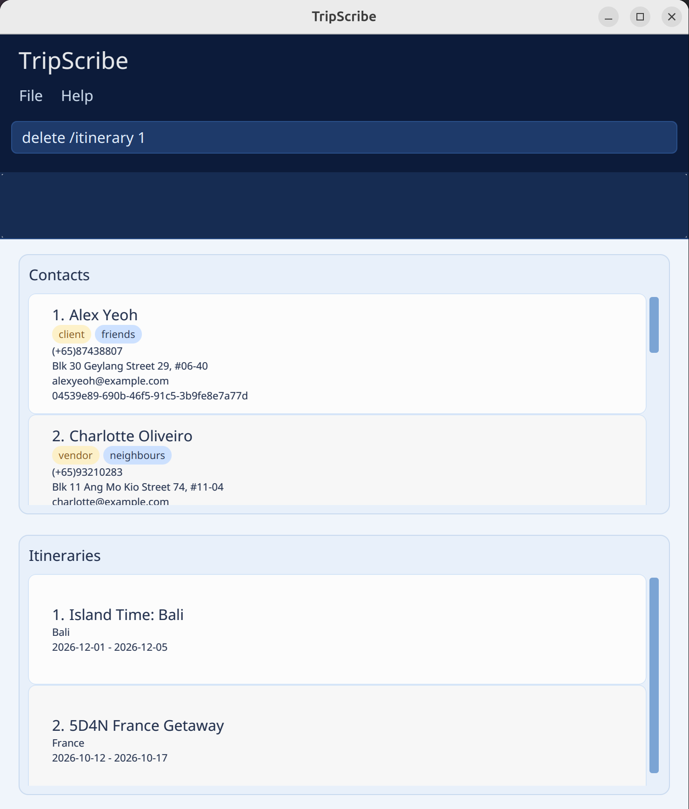<br>Input | * 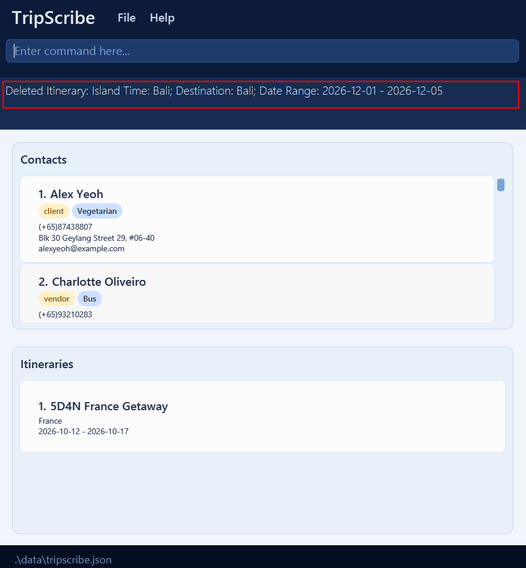<br>Expected Output |
|:---------------------------------------------------------------------------------------------------------------------:|:---------------------------------------------------------------------------------------------------------------------------:|

<div style="page-break-after: always;"></div>

### Clearing All Entries : `clear`

You can clear all your contacts and itineraries from TripScribe using this command. 

Use this whenever a new cycle of itineraries happens, and you need a clean slate.

<box type="warning" seamless>

**Warning:**
This command is **irreversible** and will remove **all existing data**. Only use this when you are sure you need to remove all your existing data as this operation cannot be undone. 

</box>


**Format:**
```
clear
```

### Exiting TripScribe : `exit`

You can exit TripScribe using this command. Your data will be saved automatically on exit. 

**Format:**
```
exit
```

<box type="tip" seamless>

**Tip:**
You can also exit TripScribe by clicking **`File`**, followed by **`Exit`**, in the menu bar.

</box>

<div style="page-break-after: always;"></div>


### Command Summary

| Action                                                | Format                                                                                                                                                                             | Example                                                                                                       |
|-------------------------------------------------------|------------------------------------------------------------------------------------------------------------------------------------------------------------------------------------|---------------------------------------------------------------------------------------------------------------|
| [**help**](#viewing-help--help)                       | `help`                                                                                                                                                                             | -                                                                                                             |
| [**addc**](#adding-a-contact-addc)                    | `addc r/ROLE n/NAME p/PHONE_NUMBER e/EMAIL a/ADDRESS [t/TAG]…​`                                                                                                                    | `addc r/client n/James Ho p/(+65) 22224444 e/jamesho@example.com a/123, Clementi Rd, 1234665 t/PeanutAllergy` |
| [**addi**](#adding-an-itinerary-addi)                 | `addi n/ITINERARY_NAME dest/DESTINATION from/START_DATE to/END_DATE [c/CLIENT_INDEX]…​ [v/VENDOR_INDEX]…​`                                                                         | `addi n/5D4N France Getaway dest/France from/2026-10-12 to/2026-10-17 c/2 v/4`                                |
| [**list**](#listing-contacts-and-itineraries-list)    | `list /FLAG`                                                                                                                                                                       | `list /contact`                                                                                               |
| [**edit**](#editing-contacts-and-itineraries-edit)    | `edit /contact INDEX [r/ROLE] [n/NAME] [p/PHONE_NUMBER] [e/EMAIL] [a/ADDRESS] [t/TAG]…​` </br> `edit /itinerary INDEX [n/NAME] [dest/DESTINATION] [from/START_DATE] [to/END_DATE]` | `edit /contact 2 n/James Lee e/jameslee@example.com` </br> `edit /itinerary 3 from/2026-10-13 to/2026-10-18`  |
| [**show**](#showing-contacts-by-itinerary-show)       | `show INDEX`                                                                                                                                                                       | `show 2`                                                                                                      |
| [**find**](#finding-contacts-by-keywords-find)        | `find KEYWORD [MORE_KEYWORDS]` </br> `find [PREFIX/KEYWORD]`                                                                                                                       | `find James Jake` </br> `find n/Jane a/Apple Street`                                                          |
| [**delete**](#deleting-a-contact-or-itinerary-delete) | `delete /FLAG INDEX`                                                                                                                                                               | `delete /contact 3`                                                                                           |
| [**clear**](#clearing-all-entries-clear)              | `clear`                                                                                                                                                                            | -                                                                                                             |
| [**exit**](#exiting-tripscribe-exit)                  | `exit`                                                                                                                                                                             | -                                                                                                             |

--------------------------------------------------------------------------------------------------------------------
<div style="page-break-after: always;"></div>


## Data Management

### Saving Your Data

TripScribe automatically saves your data in the hard disk after any command that changes the data. You **do not** need to save data manually.

### Backing Up Your Data

It is recommended that you back up your data regularly, especially if you plan to edit your data directly.

**Backing up your data file:**
1. Navigate to the folder containing `TripScribe.jar`.
2. Copy the entire `data` folder to a safe location (e.g., an external drive, cloud storage, etc.). 

**Restoring your data using a back-up:**
1.  Navigate to the folder containing `TripScribe.jar`.
2. Delete the current `data` folder.
3. Copy the entire backup folder into the folder.
4. Rename the backup folder to `data`.

### Editing Your Data File

TripScribe stores your data as a JSON file found in `[JAR file location]/data/tripscribe.json`.<br>
* Example: If your JAR file is at `C:\Users\YourName\TripScribe\TripScribe.jar`, your data file is at `C:\Users\YourName\TripScribe\data\tripscribe.json`

<box type="tip" seamless>

**Note:** When you first run TripScribe, the data file is not created immediately. Your data file is created only after your first updates and edits to the data.  

</box>

If you are an advanced user, you can update data directly by editing this file by following these steps:

1. Find the data file named `tripscribe.json` as mentioned above.
2. Open the data file. Since the data is stored as a JSON file, you will need to open the file using a text editor. Here are some suggested applications you can use to open the file:
    * Linux users:  Visual Studio Code
    * Windows users: Notepad (Built-in), Visual Studio Code
    * Mac users: TextEdit (Built-in), Visual Studio Code
3. Edit the data using the text editor, and save your changes. When making edits, take care in maintaining the data storage format as follows:

```
{
  "persons" : [ {
    "id" : ID,
    "role" : ROLE,
    "name" : NAME,
    "phone" : PHONE_NUMBER,
    "email" : EMAIL,
    "address" : ADDRESS,
    "tags" : [ TAGS ]
  } ],
  "itineraries" : [ {
    "name" : ITINERARY_NAME,
    "destination" : ITINERARY_DESTINATION,
    "startDate" : START_DATE,
    "endDate" : END_DATE,
    "clientIds" : [ CLIENT_IDS ],
    "vendorIds" : [ VENDOR_IDS ]
  } ]
}
```
<box type="warning" seamless>

**Warning:** 
If you save the file in an invalid format, TripScribe will **discard all invalid data** and start only with valid data at the next run. This includes editing fields outside the acceptable range (e.g., editing the role of a contact to anything other than `client` or `vendor`).<br>

Therefore, edit the data file only if you know what you are doing. If you wish to edit your data file, you are recommended to create a backup of the file prior (refer to [Backing Up Your Data](#backing-up-your-data) above for more information).<br>

</box>


--------------------------------------------------------------------------------------------------------------------
<div style="page-break-after: always;"></div>

## FAQ

**Q**: How do I transfer my data to another computer?<br>
**A**: Follow these steps below:<br>
  1. Create a back-up of your data on your old computer. You can refer to [Backing Up Your Data](#backing-up-your-data) for more details.
  2. Install TripScribe on your new computer. You can refer to [Quick Start](#quick-start) for more details.
  3. Replace the data folder on your new computer with your back-up.


**Q**: Can TripScribe handle multiple data files?<br>
**A**: No, TripScribe can only use one data file while the application is running. One way you can use multiple data files would be to name the data files differently, and update the `addressBookFilePath` field in the `preferences.json` file before each time you start up the application.


**Q**: How do I manually edit the data file?<br>
**A**: We recommend that you do not make any manual edits, as it may cause errors when loading the data when you start TripScribe again. However, if you are sure of what do to, you may refer to [Editing Your Data File](#editing-your-data-file) for the steps needed to edit your data.


**Q**: How do I resize the application window?<br>
**A**: You can resize the window in the same manner as other desktop applications, and the modified window size will be updated in the `preferences.json` file. The next time you start TripScribe, it will start with the same window size you had when you last exited TripScribe.


**Q**: Can I undo or redo a command?<br>
**A**: No, TripScribe currently does not support undo or redo commands. Commands that modify data take effect immediately and cannot be reversed. Hence, we recommend that you:
  1. Double-check before using `delete` or `clear` commands
  2. Keep regular backups of your data file


**Q**: Can itineraries have the same date as the start date and end date?<br>
**A**: Yes. You can add 1-day itineraries to TripScribe.


**Q**: How do I add new contacts to an existing itinerary in TripScribe?<br>
**A**: Follow these steps below: <br>
   1. Use the `show` command to find all the relevant contacts associated with the itinerary you are working on. **Note down the contacts and the itinerary details** (e.g., copy and paste all information on a Word document).
   2. Using the `delete` command, delete the itinerary you want to add the contact to.
   3. Using the `addi` command, enter the itinerary details (itinerary name, destination, start and end date) you saved in Step 1. Use the `c/` and `v/` prefixes to add the contacts you saved in Step 1, and any new clients you want to add.

**Q**: What if I want a contact to have different roles in different itineraries?<br>
**A**: TripScribe expects a contact to have exactly one role across all itineraries. This means that a contact cannot be simultaneously a client and a vendor in different itineraries. Individuals with multiple roles should have dedicated phone numbers or aliases for each role.


**Q**: What happens if I delete a contact associated to itineraries?<br>
**A**: When you delete a contact, TripScribe automatically removes them from **all** itineraries they are part of. The itineraries themselves will remain, but that contact will no longer be associated with them to ensure data consistency.


**Q**: What happens if I delete an itinerary associated with contacts?<br>
**A**: Similar to when you delete a contact, TripScribe only deletes the itinerary itself. The associated contacts themselves will remain, but that contact will no longer be associated with that itinerary to ensure data consistency.


--------------------------------------------------------------------------------------------------------------------
<div style="page-break-after: always;"></div>

## Troubleshooting
This section helps you resolve common issues you might encounter while using TripScribe.

### Adding Contacts

**Issue**: "Duplicate contact: ..." error
- Scenario: TripScribe detected a duplicate contact (same name and phone number).
- Fix 1: If your intention is to update an existing contact, use the [edit command](#editing-contacts-and-itineraries-edit) instead.
- Fix 2: If your intention is to add a different contact, change the name slightly or use a different phone number.

**Issue**: "Invalid role: ..." error
- Scenario**: TripScribe detected in invalid role (role can only be 'client' or 'vendor').
- Fix 1: If your intention is to label the contact with something more specific, add that as a tag instead.
  - Example: `r/BusDriver` is invalid, correct it to `r/vendor t/BusDriver`
- Fix 2: If you mistyped, correct the role to either 'client' or 'vendor' exactly.

**Issue**: "Invalid email: ..." error
- Scenario: TripScribe detected the wrong email format.
- Fix: Correct the email to use the following format: `LOCAL_PART@DOMAIN`
  - `LOCAL_PART`: A part of an email consisting of only alphanumeric characters and the following symbols: `+`,`_`, `.`, `-`, It cannot start or end with special characters. (e.g., `alex_yeoh`)
  - `DOMAIN`: A part of an email consisting of [domain labels](#glossary) separated by dots `.`. Only alphanumeric characters and hyphens are allowed, and it cannot start or end with a hyphen. The final domain label must be at least 2 characters long. (e.g., `example.domain.com`)
  - Example: `gmail: alexyeo`is invalid, correct it to `alexyeo@gmail.com`.

### Adding Itineraries

**Issue**: "Duplicate itinerary: ..." error
- Scenario: TripScribe detected a duplicate itinerary (same name, destination and duration).
- Fix 1: If your intention is to update an existing itinerary, use the [edit command](#editing-contacts-and-itineraries-edit) instead.
- Fix 2: If your intention is to add a different itinerary, change the name slightly.

**Issue**: "Invalid date range: ..." error
- Scenario: Start date is **after** end date (e.g., `from/2026-01-05 to/2026-01-01`).
    - Fix: Make sure the start date you enter is before or on the same day as the end date.

**Issue**: "Invalid role: ..." error
- Scenario: TripScribe detected a mismatch between the prefix given, and the contact's role format. (e.g., 3rd contact was added as a client `c/3`, but the 3rd contact in the list is a `vendor`).
      - Fix: Make sure you put the correct role prefix (either `c/` or `v/`) for each contact by referring to the currently displayed list.

**Issue**: Invalid command format error when adding multiple contacts
- Scenario: TripScribe detected the wrong prefix format.
- Fix: Ensure every contact index has the correct prefix.
    - Example: `c/1 2 3 v/4 5`is invalid, correct it to `c/1 c/2 c/3 v/4 v/5`.

<div style="page-break-after: always;"></div>

### Editing Contacts
**Issue**: All tags for a contact have disappeared.
- Scenario: No tags were specified when using `edit` to modify a contact's tags (e.g., `edit /contact 1 t/`).
    - Fix: Use the `edit` command again and specify the tags, each prefixed with `t/` (e.g., `t/Vegetarian t/ChineseSpeakingOnly`)

### Editing Itineraries
**Issue**: "Invalid date range: ..." error
- Scenario: The intended edit results in start date being **after** end date (e.g., `from/2026-01-05 to/2026-01-01`).
    - Fix: Make sure the start date you enter is before or on the same day as the end date.

### Finding Contacts
**Issue**: "Invalid command format!  ..." error
- Scenario 1: No keywords were supplied in the command.
  - Fix: Enter at least one keyword to search for a contact.
- Scenario 2: Mixing of general search and multi-field search formats (e.g., `find Ryan p/(+65)`)<br>
  To resolve this, you should follow one of the following fixes:<br>
  - Fix 1: Use general search format only. `find ryan (+65)`
  - Fix 2: Use multi-field search format only `find n/Ryan p/(+65)`

<div style="page-break-after: always;"></div>

## Glossary

This section defines all the specialized terms used in TripScribe to help you understand the application better.

* **Alphanumeric characters**: Characters consisting of letters (A–Z, a–z) and numbers (0–9).
* **Case-Insensitive Text**: Text where uppercase and lowercase letters are treated as equivalent.
* **Client**: A person who participates in a tour organized by the agency.
* **Command Line Interface (CLI) Application**: An application that users interact with by typing commands.
* **Domain-label**: A part of a domain name separated by dots, consisting of alphanumeric characters and hyphens, but not beginning or ending with a hyphen.
* **Flag**: An option used with a command to specify or modify its behavior.
* **Graphical User Interface (GUI) Application**: An application that users interact with through graphical elements such as buttons, icons, and menus using a mouse or keyboard.
* **Index**: The position number of an entry as shown in the currently displayed list. For example, the 1st entry shown has index `1`. The index changes depending on the current list view. Indexes start from `1`.
* **Itinerary**: A plan for a tour that includes the tour name, start and end dates, the clients participating in the tour, and the vendors involved.
* **JAR file**: Java Archive file. Refers to the TripScribe application that you run, `TripScribe.jar`).
* **JSON file**: JavaScript Object Notation file. A text-based data format used to store TripScribe's data (e.g., `tripscribe.json`).
* **Local-part**: A part of an email consisting of only alphanumeric characters and the following symbols: `+`,`_`, `.`, `-`, It cannot start or end with special characters.
* **Mainstream OS**: Operating systems such as Windows, Linux, Unix and macOS.
* **Parameter**: A piece of information you provide to a command.
* **Prefix**: A short code that identifies the type of information which follows (e.g., `n/` for name, `p/` for phone, `e/` for email, etc.).
* **Tag**: A label used to categorize any number of entries together.
* **Vendor**: A party that provides goods or services for a tour.

<div style="page-break-after: always;"></div>

## Known Issues

1. **When using multiple screens**, if you move the application to a secondary screen, and later switch to using only the primary screen, the GUI will open off-screen. 
   * To fix this, delete the `preferences.json` file created by TripScribe before running the application again.
<br>

2. **If you minimize the Help Window** and then run the `help` command (or use the `Help` menu, or the keyboard shortcut `F1`) again, the original Help Window will remain minimized, and no new Help Window will appear. 
   * To fix this, close the minimized Help Window and type the command again.
