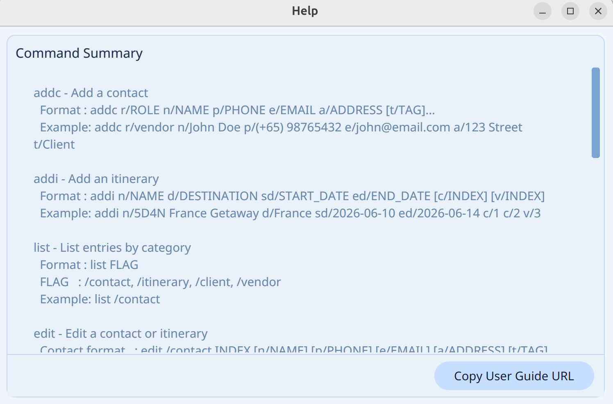
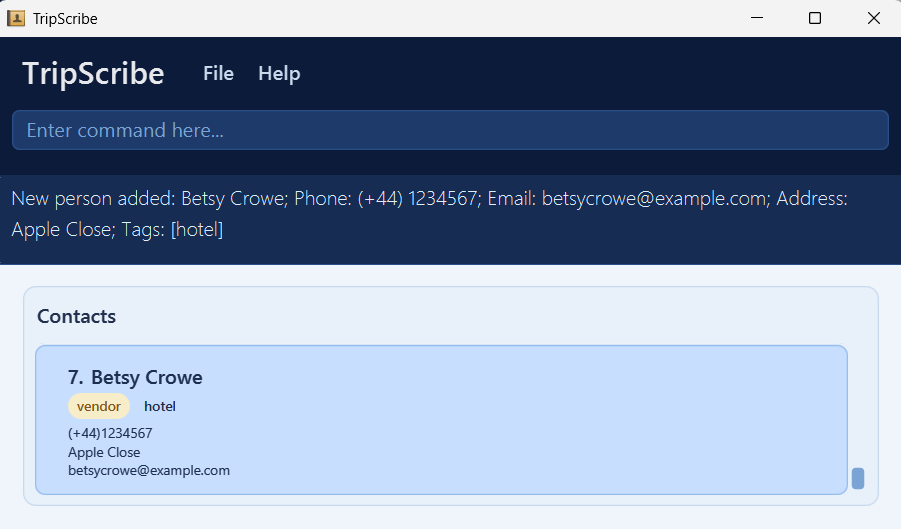

# TripScribe User Guide

TripScribe lets you manage contacts and itineraries on your desktop using keyboard commands with an informative Graphical User Interface (GUI). If you type fast, you can plan and organize your trips much faster with TripScribe than traditional mouse-based apps.

**Target User:** TripScribe is an application meant for operations executives at small to mid-sized tour agencies who manages client bookings and itineraries. Their role involves frequently updating itineraries, client details and vendor booking notes, while coordinating across multiple groups such as transport providers, tour guides, vendors, and tourists. 

**New to TripScribe?** Start with [Quick Start](#quick-start) to install the app and try your first commands.

**Looking for a specific command?** Jump to the [Command Summary](#command-summary) for a quick reference, or pick a feature from the table of contents below.

<!-- * Table of Contents -->
<page-nav-print />

--------------------------------------------------------------------------------------------------------------------
## Table of Contents

1. [Quick Start](#quick-start)
2. [Features](#features)
    - [Reading Command Format](#reading-command-formats)
    - [Viewing Help : `help`](#viewing-help-help)
    - [Adding a Contact : `addc`](#adding-a-contact-addc)
    - [Adding an Itinerary : `addi`](#adding-an-itinerary-addi)
    - [Listing Contacts and Itineraries : `list`](#listing-contacts-and-itineraries-list)
    - [Editing a Contact : `edit`](#editing-a-contact-edit)
    - [Showing details of an itinerary: `show`](#showing-contacts-by-itinerary-show)
    - [Finding Contacts by Name : `find`](#finding-contacts-by-name-find)
    - [Deleting a Contact or Itinerary : `delete`](#deleting-a-contact-or-itinerary-delete)
    - [Clearing All Entries : `clear`](#clearing-all-entries-clear)
    - [Exiting TripScribe : `exit`](#exiting-tripscribe-exit)
3. [Data Management](#data-management)
4. [FAQ](#faq)
5. [Known Issues](#known-issues)
6. [Command Summary](#command-summary)

--------------------------------------------------------------------------------------------------------------------

## Quick Start

#### 1. Set Up Java for TripScribe
TripScribe needs Java `17` or above to run. Here is how to check if you already have it installed:
* Open a command terminal as follows:

    | Your computer | Steps to open a terminal                          |
    |---------------|---------------------------------------------------|
    | Windows       | Press `Win + R`, type `cmd`, press Enter          |
    | Mac           | Press `Cmd + Space`, type `Terminal`, press Enter |
    | Linux         | Press `Ctrl + Alt + T`                            |

* Type the following command and press Enter:
  ```
  java -version
  ```
* If the output shows `version "17"` or higher, you are all set. If you get an error, download Java 17 by following one of these guides:
  * Installation guide for Linux users [here](https://se-education.org/guides/tutorials/javaInstallationLinux.html).
  * Installation guide for Windows users [here](https://se-education.org/guides/tutorials/javaInstallationWindows.html).
  * Installation guide for Mac users [here](https://se-education.org/guides/tutorials/javaInstallationMac.html).

#### 2. Download TripScribe
* Download the latest `tripscribe.jar` from [here](https://github.com/AY2526S2-CS2103T-F12-1/tp/releases)
* Move the file to a folder of your choice. For example, a folder called `TripScribe` on your desktop.

#### 3. Run TripScribe
* Open a command terminal, as described in Step 1.
* Navigate into the folder containing the `tripscribe.jar` file using the `cd` command:
  ```
  cd path/to/your/folder
  ```
  * For example:
    * **Linux/Mac:** `cd ~/Desktop/TripScribe`
    * **Windows:** `cd C:\Users\YourName\Desktop\TripScribe`
* Run TripScribe by typing the command `java -jar tripscribe.jar` into the terminal.<br>
 A pop-up window similar to the below should appear in a few seconds. On first start, the app will load sample data so you can explore its features right away.<br>
 

#### 4. Try Your First Commands
* Type a command in the **command box** and press Enter to execute it. 
* Commands follow a consistent format throughout this guide. In brief, words in UPPER_CASE are values you supply, and items in [square brackets] are optional. For a full explanation, see [Reading Command Formats](#reading-command-formats). 
* Try some example commands to get started:

| Action                                             | Command                                                                                          |
|----------------------------------------------------|--------------------------------------------------------------------------------------------------|
| List all contacts                                  | `list /contact`                                                                                  |
| Add a contact named `John Doe`                     | `addc r/client n/John Doe p/(+65) 98765432 e/johnd@example.com a/John street, block 123, #01-01` |
| Add an itinerary named `Bali Getaway`              | `addi n/Bali Getaway dest/Bali from/2026-07-01 to/2026-07-05`                                    |
| Delete the third contact shown in the current list | `delete /contact 3`                                                                              |
| Clear all contacts and itineraries                 | `clear`                                                                                          |
| Open the help window                               | `help`                                                                                           |
| Exit TripScribe                                    | `exit`                                                                                           |

You can refer to the [Features](#features) below to learn more details of each command.

--------------------------------------------------------------------------------------------------------------------

## Features

### Reading Command Formats

<box type="info" seamless>

* Words in `UPPER_CASE` are values you supply.
  * **Example:** In `addc r/ROLE`, `ROLE` is entered as `addc r/client`.

* Items in square brackets are optional.
    * **Example:** `n/NAME [t/TAG]` can be entered as `n/John Doe t/Bus` or `n/John Doe`.

* Inputs with `…`​ after them can be used zero or more times.
    * **Example:**`[t/TAG]…​` can be used as ` ` (i.e. zero times), `t/Bus`, `t/Bus t/Speaks English` etc.

* Information can be supplied in any order.
    * **Example:** If the command specifies `n/NAME p/PHONE_NUMBER`, `p/PHONE_NUMBER n/NAME` is also acceptable.

* Additional parameters for commands that do not require them (such as `help`, `exit` and `clear`) will be ignored.
    * **Example:** `help 123` is interpreted as `help`.

* If you are using a PDF version of this document, be careful when copying and pasting commands that span multiple lines, as there may be formatting issues which affect the copied text.
</box>

### Viewing help : `help`

Open a help window that summarizes all commands and links to this guide.

**Format:**
```
help
```



### Adding a Contact: `addc`

Add a contact to TripScribe.

**Format:**
```
addc r/ROLE n/NAME p/PHONE_NUMBER e/EMAIL a/ADDRESS [t/TAG]…​
```

<box type="tip" seamless>

**Things to note:**
- `ROLE` must be either `client` or `vendor`
- A contact can have any number of tags (including zero)
- Phone numbers should follow the format `(+<Country Code>) <Phone Number>`
  - Example: `(+65) 98765432`.
- TripScribe treats two contacts as duplicates if they share the same name **and** phone number. Duplicate contacts cannot be added.

</box>

**Examples:**
* `addc r/client n/John Doe p/(+65) 98765432 e/johnd@example.com a/John street, block 123, #01-01`
* `addc r/vendor n/Betsy Crowe t/friend e/betsycrowe@example.com a/Newgate Prison p/(+44) 1234567 t/hotel`



### Adding an Itinerary: `addi`

Add an itinerary to TripScribe.

**Format:** 
```
addi n/ITINERARY_NAME dest/DESTINATION from/START_DATE to/END_DATE [c/CLIENT_INDEX]…​ [v/VENDOR_INDEX]…​
```

<box type="tip" seamless>

**Things to note:**
- `ITINERARY_NAME` and `DESTINATION` cannot be blank.
- TripScribe treats two itineraries as duplicates if they share the same name (case-insensitive). Duplicate itineraries cannot be added.
  - Example: Itineraries with the names `ISLAND TIME: Bali` and `Island Time: Bali` are considered duplicates.
- `START_DATE` and `END_DATE` must be in the format `yyyy-mm-dd`.
  - Example: `20th March 2026` should be written as `2026-03-20`.
- `END_DATE` must be **equal to or after** `START_DATE`.
  - Example: `from/2026-03-20 to/2026-03-19` is not allowed.
- `CLIENT_INDEX` and `VENDOR_INDEX` are the indexes of the contacts in the current TripScribe window.
- An itinerary can have any number of clients and vendors (including zero).
- If you want to add multiple clients or vendors into the itinerary, indicate the type for each index.
  - Example: `c/2 c/3 c/4 v/1 v/2 v/3` to add the second, third and fourth client in the client list and the first, second and third vendor in the vendor list.  
</box>

**Examples:**
* `addi n/Island Time: Bali dest/Bali from/2026-12-01 to/2026-12-05`
* `addi n/5D4N France Getaway dest/France from/2026-10-12 to/2026-10-17 c/2 v/4`
* `addi n/3D2N Trip of China dest/China from/2026-5-02 to/2026-5-07 c/2 c/3 c/5 v/4 v/5`

| <br>Input | <br>Expected Output |
|:------------------------------------------------------------------------------------:|:----------------------------------------------------------------------------------------:|

### Listing Contacts and Itineraries : `list`

See a list of contacts or itineraries based on the specified flag.

**Format:**
```
list /FLAG
```
<box type="tip" seamless>

**Things to note:**
* `FLAG` specifies the entry type you are listing. It must be one of: `contact`, `client`, `vendor`, `itinerary`, `all`.

    | Flag        | What you see                           |
    |-------------|----------------------------------------|
    | `contact`   | All contacts, both clients and vendors |
    | `client`    | Only clients                           |
    | `vendor`    | Only vendors                           |
    | `itinerary` | All itineraries                        |
*   | `all`       | All contacts and itineraries           |


* When you view contacts (`/contact`, `/client`, `/vendor`), TripScribe hides the itinerary panel.
* When you view  itineraries (`/itinerary`), TripScribe hides the contact panel.
</box>

**Examples:**
* `list /contact`
* `list /client`
* `list /vendor`
* `list /itinerary`
* `list /all`

### Editing a Contact : `edit`

You can edit an existing contact or itinerary in TripScribe.

**Formats:**
```
edit /contact INDEX [n/NAME] [p/PHONE] [e/EMAIL] [a/ADDRESS] [t/TAG]…​
```
```
edit /itinerary INDEX [n/NAME] [dest/DESTINATION] [from/START_DATE] [to/END_DATE] ​
```
<box type="tip" seamless>

**Things to note:**

* Edits the contact or itinerary at the specified `INDEX`.
* `INDEX` is the index number shown in the displayed person or itinerary list. It **must be a positive, non-zero number** 1, 2, 3, …​
* Include at least one field to change.
* When editing contacts, editing tags replaces all existing tags of the contact, it does not add on to them.
* You can remove all the person’s tags by typing `t/` without specifying any tags after it.
* When editing itineraries, you must ensure that the end date is after the start date. 

</box>

**Examples:**
*  `edit /contact 1 p/(+65) 91234567 e/johndoe@example.com`
  * Edits the phone number and email address of the 1st person to be `(+65) 91234567` and `johndoe@example.com` respectively.
*  `edit /contact 2 n/Betsy Crower t/`
  * Edits the name of the 2nd person to be `Betsy Crower` and clears all existing tags.
* `edit /itinerary 1 n/Bali 4D3N`
  * Edits the name of the first itinerary to be `Bali 4D3N`

### Showing contacts by itinerary: `show`

Show details of an itinerary and the contacts associated with it in TripScribe.  

**Format:**
```
show INDEX
```

<box type="tip" seamless>

**Things to note:**

* Shows contacts and itinerary details of itinerary at specified `INDEX`.
* `INDEX` is the index number shown in the itinerary list. It **must be a positive, non-zero number** 1, 2, 3, …​

</box>

**Examples:**
*  `show 2` 
  * Shows details of the 2nd itinerary, and the contacts associated with it.


### Finding Contacts by Keywords: `find`

Finds contacts whose fields match the given keywords. TripScribe supports both general search and multi-field search.

**Formats:**
```
find KEYWORD [MORE_KEYWORDS]… ​
```
```
find [n/NAME_KEYWORDS] [p/PHONE_KEYWORDS] [e/EMAIL_KEYWORDS] [a/ADDRESS_KEYWORDS] [t/TAG_KEYWORDS]… ​
```

<box type="tip" seamless>

**Things to note:**
* __Use one of the formats only. Do not mix general search and multi-field search.__
  * Example: `find Hans p\9876` does not work.
* The search is case-insensitive.
  * Example: `hans` will match `Hans`
* The order of the keywords does not matter.
  * Example: `Hans Bo` will match `Bo Hans`
* Partial matches are allowed.
  * Example: `Han` will match `Hans`
* In general search, a contact is returned if any keyword appears in any searchable field.
* In multi-field search:
  * keywords within the same field are matched using `OR`
  * keywords across different fields are matched using `AND`

</box>

**Examples:**
* `find John` returns contacts whose name, phone, email, address, or tags contain `John`.
* `find alex david` returns contacts containing `alex` or `david` in any searchable field.
* `find e/example.com` returns contacts with `example.com` in their saved email.
* `find n/alex david` returns contacts whose names contain `alex` or `david`
* `find n/alex p/996` returns contacts whose names contain `alex` and whose phone numbers contain `996`.
  * `find n/alex david p/992 281` returns contacts whose names contain `alex` or `david` and phone numbers contain `992` or `281` <br>
    

### Deleting a Contact or Itinerary : `delete`

Delete a specified contact or itinerary from TripScribe.

**Format:**
```
delete /FLAG INDEX
```
<box type="tip" seamless>

**Things to note:**
* Deletes the contact or itinerary at the specified `INDEX`.
* `FLAG` specifies the entry type you are deleting. It must be one of: `contact` , `itinerary`.
* `INDEX` is the index number shown in the displayed person or itinerary list. It **must be a positive, non-zero number** 1, 2, 3, …​

</box>

**Examples:**
* `list /contact` followed by `delete /contact 2` deletes the second contact in TripScribe.

| <br>Input | <br>Expected Output |
|:--------------------------------------------------------------------------------------:|:--------------------------------------------------------------------------------------------------:|

* `list /itinerary` followed by `delete /itinerary 1` deletes the first itinerary in TripScribe.

 | <br>Input | <br>Expected Output |
 |:------------------------------------------------------------------------------------------:|:----------------------------------------------------------------------------------------------:|


### Clearing All Entries : `clear`

Clear all contacts and itineraries from TripScribe.

**Format:**
```
clear
```

### Exiting TripScribe : `exit`

Exit TripScribe.

**Format:**
```
exit
```
--------------------------------------------------------------------------------------------------------------------

## Data Management

### Saving Data

TripScribe saves your data in the hard disk automatically after any command that changes the data. You do not need to save manually.

### Editing the Data File

TripScribe stores your data automatically as a JSON file found in `[JAR file location]/data/tripscribe.json`. If you are an advanced user, you can update data directly by editing this file.

<box type="warning" seamless>

**Caution:**
If you save the file in an invalid format, TripScribe will discard all data and start with an empty data file at the next run. Hence, you are recommended to create a backup of the file before editing it.<br>
Furthermore, certain edits can cause TripScribe to behave in unexpected ways (e.g., if a value entered is outside the acceptable range). Therefore, edit the data file only if you know what you are doing.

</box>

--------------------------------------------------------------------------------------------------------------------

## FAQ

**Q**: How do I transfer my data to another computer?<br>
**A**: Install TripScribe on the other computer and replace the empty data file it creates with your file that contains the data of your previous TripScribe application folder.

--------------------------------------------------------------------------------------------------------------------

## Known Issues

1. **When using multiple screens**, if you move the application to a secondary screen, and later switch to using only the primary screen, the GUI will open off-screen. 
   * To fix this, delete the `preferences.json` file created by TripScribe before running the application again.
<br><br>
2. **If you minimize the Help Window** and then run the `help` command (or use the `Help` menu, or the keyboard shortcut `F1`) again, the original Help Window will remain minimized, and no new Help Window will appear. 
   * To fix this, close the minimized Help Window and type the command again.

--------------------------------------------------------------------------------------------------------------------

## Command Summary

| Action                                                | Format                                                                                                                                                               | Example                                                                                                            |
|-------------------------------------------------------|----------------------------------------------------------------------------------------------------------------------------------------------------------------------|--------------------------------------------------------------------------------------------------------------------|
| [**help**](#viewing-help-help)                        | `help`                                                                                                                                                               | -                                                                                                                  |
| [**addc**](#adding-a-contact-addc)                    | `addc r/ROLE n/NAME p/PHONE_NUMBER e/EMAIL a/ADDRESS [t/TAG]…​`                                                                                                      | `addc r/client n/James Ho p/(+65) 22224444 e/jamesho@example.com a/123, Clementi Rd, 1234665 t/friend t/colleague` |
| [**addi**](#adding-an-itinerary-addi)                 | `addi n/ITINERARY_NAME dest/DESTINATION from/START_DATE to/END_DATE [c/CLIENT_INDEX]…​ [v/VENDOR_INDEX]…​`                                                           | `addi n/5D4N France Getaway dest/France from/2026-10-12 to/2026-10-17 c/2 v/4`                                     |
| [**list**](#listing-contacts-and-itineraries-list)    | `list /FLAG`                                                                                                                                                         | `list /contact`                                                                                                    |
| [**edit**](#editing-a-contact-edit)                   | `edit /contact [n/NAME] [p/PHONE_NUMBER] [e/EMAIL] [a/ADDRESS] [t/TAG]…​` </br>  `edit /itinerary INDEX [n/NAME] [dest/DESTINATION] [from/START_DATE] [to/END_DATE]` | `edit 2 n/James Lee e/jameslee@example.com`                                                                        |
| [**show**](#editing-a-contact-edit)                   | `show INDEX`                                                                                                                                                         | `show 2`                                                                                                           |
| [**find**](#finding-contacts-by-name-find)            | `find KEYWORD [MORE_KEYWORDS]`  </br> `find [PREFIX/KEYWORD]`                                                                                                        | `find James Jake` </br> `find a/Apple Street`                                                                      |
| [**delete**](#deleting-a-contact-or-itinerary-delete) | `delete /FLAG INDEX`                                                                                                                                                 | `delete /contact 3`                                                                                                |
| [**clear**](#clearing-all-entries-clear)              | `clear`                                                                                                                                                              | -                                                                                                                  |
| [**exit**](#exiting-tripscribe-exit)                  | `exit`                                                                                                                                                               | -                                                                                                                  |
